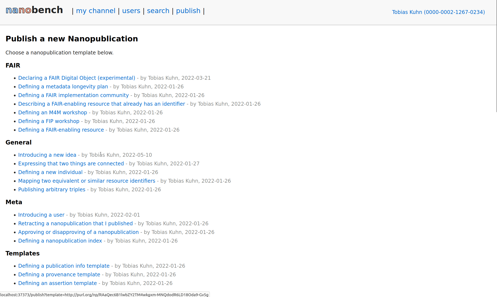

Using Nanobench for KG Metadata
===============================

Install Nanobench: https://github.com/peta-pico/nanobench

Using the template-based form:

Nanopublication defining the template: http://purl.org/np/RA9M5jS_Wk2bFn-Q1yWrgPIxE_bHWyO5a9VeUpJv_9_iA

The template can itself be created/modified in a form:

Screenshot of the filled-in form:

Example output nanopublications:

- [Wikidata](http://purl.org/np/RAtfJa2GNZXpsj2xBH9KzHXCu6toaqKY5qezzhJp1KuHc)
- [LOV](http://purl.org/np/RAGxZ5tL26QQ39bEQ-IjVj7ts5WZaJnBmm55FoBVW7y78)
