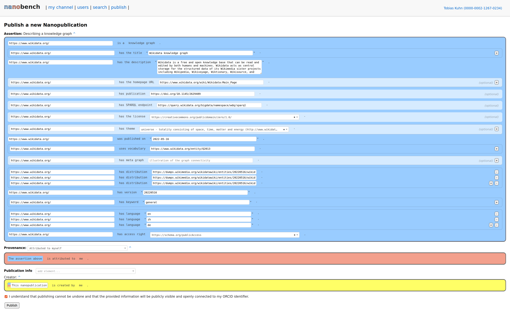

Using Nanobench for KG Metadata
===============================

Install Nanobench: https://github.com/peta-pico/nanobench

Using the template-based form:

The template can itself be created/modified in a form:

Screenshot of the filled-in form:

